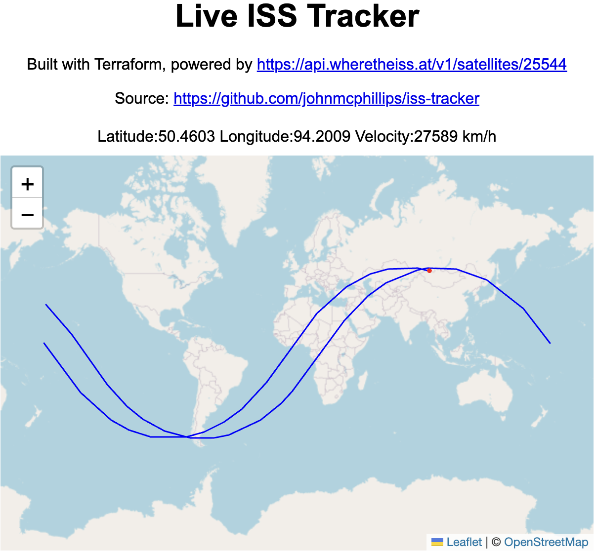

## Terraform Powered International Space Station Tracker

- No external building or tools required
- Utilizes the https://api.wheretheiss.at/v1/satellites/25544 free ISS tracking API to pull the latest ISS stats
- GET and store every 5 minutes, keeping latest and historical timestamps
- Roll-up point in time data to render polyline history
- Render position of the ISS over OpenStreetMaps
