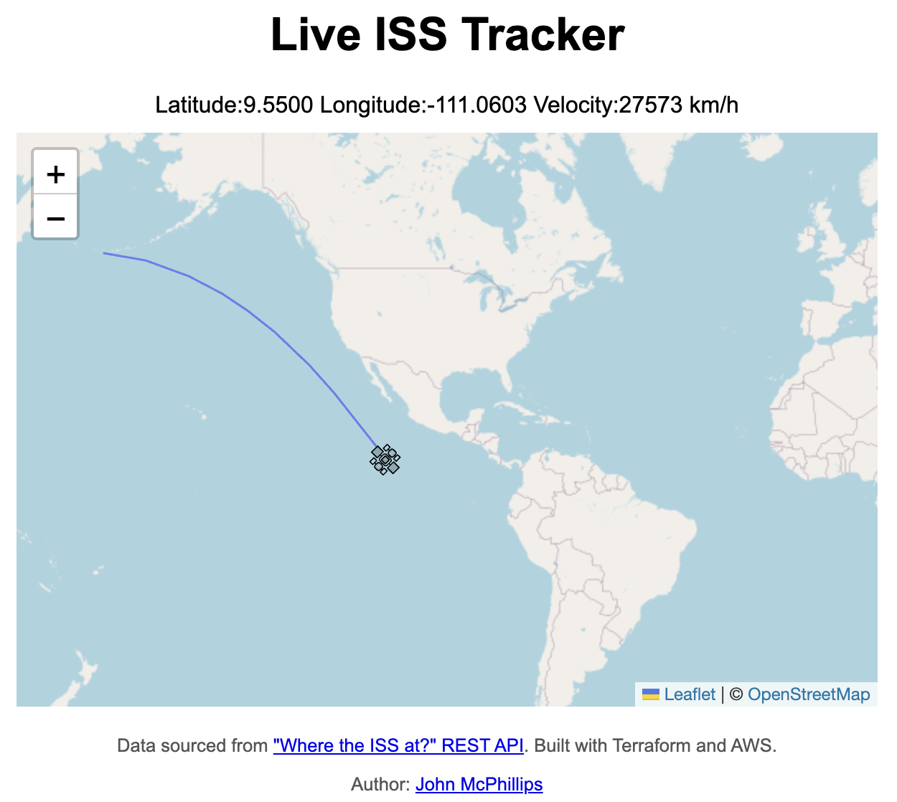

## 🛰 Terraform Powered International Space Station Tracker


- No external building or tools required
- Utilizes the https://api.wheretheiss.at/v1/satellites/25544 free ISS tracking API to pull the latest statistics
- GET and store every 1 minute, keeping latest and historical timestamps for 45 minutes of history
- Roll up point-in-time data to render polyline history
- Render position of the ISS over OpenStreetMaps, refresh async function every 10 seconds

## Terraform Cloud (TFE) Backend

- Update versions.tf with your TFE backend
```
terraform {
  cloud {
    organization = "your-org"
    workspaces {
      name = "your-workspace"
    }
  }
```
```
cd modules
terraform init
terraform apply
```
## Terraform CLI Backend
- Comment out the cloud { } block in versions.tf or delete it
```
cd modules
terraform init
terraform apply
```